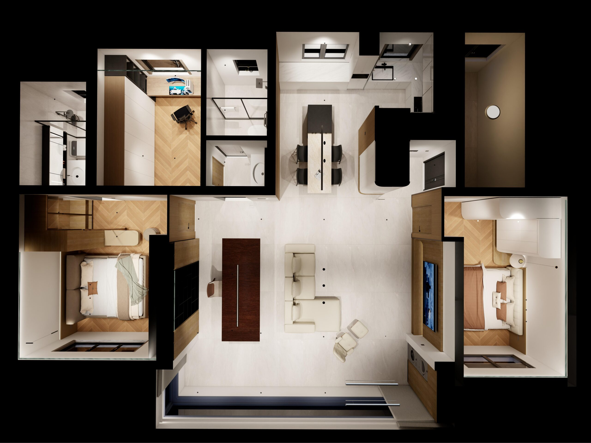
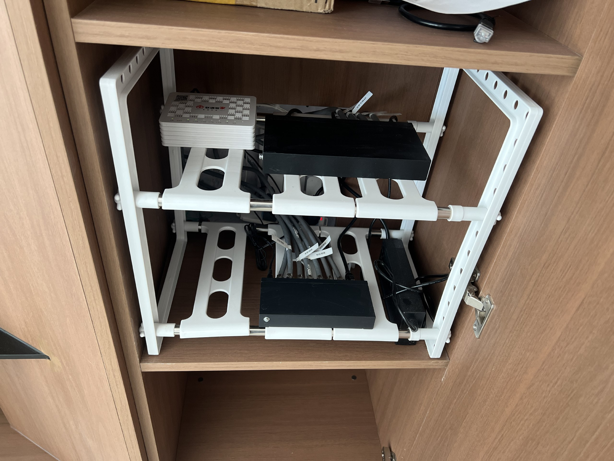
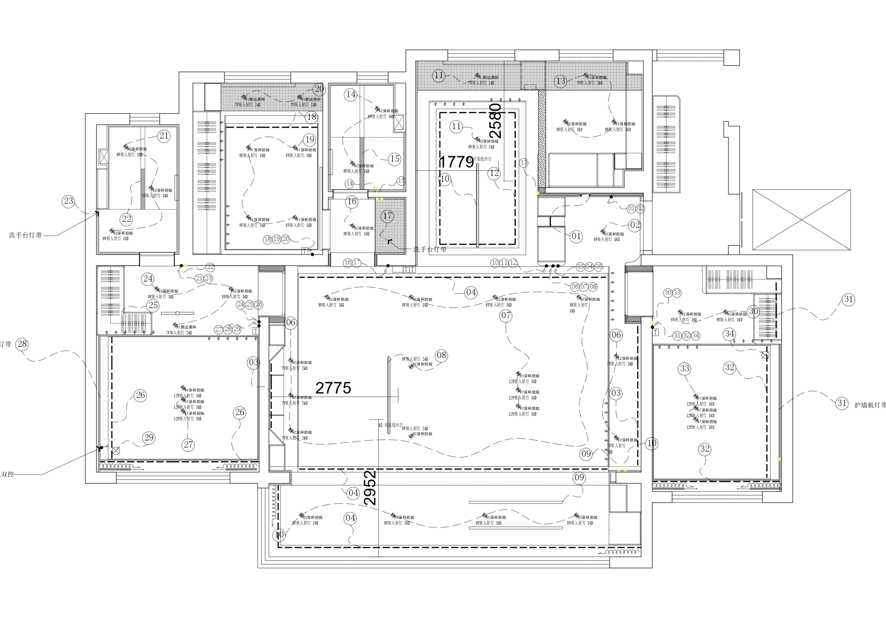
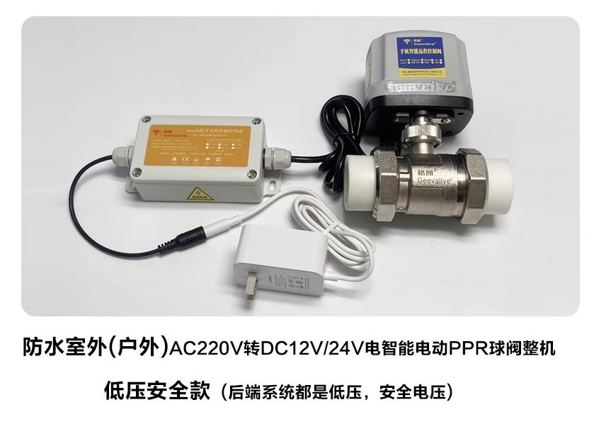
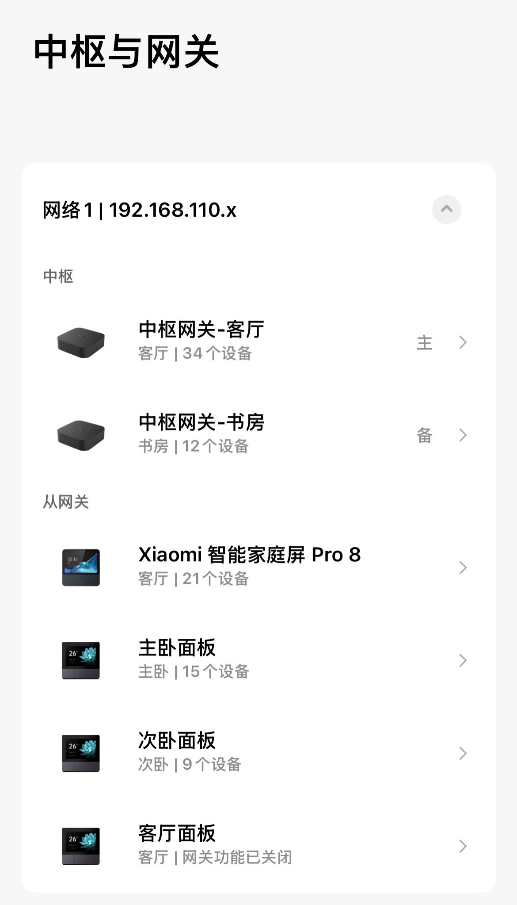

> 新房装修，面对小米之家和Aqara动辄数万的全屋智能方案，我最终选择了DIY。本文将详细记录我如何基于米家蓝牙Mesh 2.0生态，完成从水电规划、智能家居设备选型到米家自动化和Home Assistant进阶的全过程。重点分享在方案设计、安装调试中踩过的坑，为打算自己动手打造智能家居的老铁，提供一份真实的参考。

## 背景
&emsp;我家新房子从年初装修到现在已接近尾声，装修前就已经有了做全屋智能的打算。装修前考察了包括当地的小米之家、Aqara等品牌智能家居的店铺。

&emsp;整体考察下来，对小米之家和Aqara智能家居的线下店铺的感受如下：

&emsp;**（1）小米之家**

&emsp;我们当地小米之家的全屋智能业务在线下店铺有一块独立的区域展示，但是实际是外包给**第三方公司**实施的。需要在小米之家购买米家产品并付安装费用，**无其他额外费用**。但是其出具的方案中，连灯具连线图上射灯数量都搞不清楚，感觉**缺少专业性**。同时，我还想使用支持米家生态的第三方品牌产品，故Pass掉了小米之家。

&emsp;**（2）Aqara**

&emsp;Aqara出具的方案够专业，甚至有网页端可交互的方案页面体验。但是设备整体价格偏贵，且要**收取整体产品金额的30%作为维护费用**，价格太贵故不再考虑。

&emsp;在综合考虑生态开放程度、家电适配程度以及Home Assistant接入的便利程度，我决定使用小米蓝牙Mesh2.0生态的智能家居。由于在线下没有找到合适的店，我开始自己研究DIY全屋智能。
* * *
## 协议对比
| 对比维度 | Wifi协议 | 蓝牙Mesh协议 | 小米蓝牙Mesh2.0协议 |
| :-- | :-- | :-- | :-- |
| 核心定位 | 高速数据传输，互联网接 | 低功耗、自组网的设备网络 | 高性能和可靠性的低功耗、自组网的设备网络 |
| 响应速度 | 较快，但依赖云端/网络状态，可能有延迟 | 较慢，入网和执行指令有明显感知延迟 | 极快，毫秒级响应，接近本地有线体验 |
| 功耗水平 | 高，需强电供电 | 低，非常适合电池设备 | 超低，进一步优化，电池续航更长 |
| 网络拓扑 | 星型结构 (设备直连路由器) | 网状网络 (设备可中继) | 增强型网状网络，优化路由算法 |
| 设备容量 | 受路由器限制 (通常20-50个为宜) | 较高 (理论数千，实际受带宽限制) | 超高且稳定 (官方标称单网关384个) |
| 覆盖范围 | 依赖路由器，可通过Mesh Wi-Fi扩展 | 依赖设备中继，有衰减 | 依赖设备中继，但稳定性和穿透性更强 |
| 稳定性 | 一般，设备多易拥堵，受其他Wi-Fi干扰 | 一般，网络拥堵时易丢包、延迟高 | 较好，优化信道管理，高密度下依然稳定 |
| 关键优势 | 高带宽、无需额外网关、设置简单 | 低功耗、自组网、本地控制、成本低 | 快、稳、省电、大容量 |
| 主要劣势 | 高功耗、设备多易拥堵、安全性依赖网络 | 响应慢、大规模组网体验差 | 需要支持Mesh 2.0的网关，新款设备才支持 |
| 典型适用设备 | 智能摄像头、浴霸、晾衣架、电视、空调等 | 早期的智能灯泡、传感器、开关 | 新一代智能灯具、开关、窗帘、传感器、门锁 |
| 自动化 | **联动依赖云端，断网则失效** | 可本地执行，但联动慢，灯组支持数量有限 | 本地执行极速联动，是自动化极客版的理想载体 |

&emsp;以上对比基于网络上能够搜索到的信息整理。在实际规划中，一定会存在蓝牙协议与Wifi协议共用的情况。考虑到功耗、离线自动化及负载稳定性，还是建议大家可以尽量多得选择使用蓝牙协议而非Wifi协议的设备。

&emsp;市面上的主流的蓝牙协议智能家居产品基本都已经或者正在适配蓝牙Mesh2.0协议，且新老协议的设备价格差距不大，所以还是建议大家购买2.0协议的产品。**小米自家的中枢网关、三按键智能屏等其实也都通过固件更新的方式支持了Mesh2.0协议，但是其宣传材料中并未更新说明。** 所以大家如需选购一些上市多年的老产品，建议先跟客户沟通确认设备是否已经支持了Mesh2.0协议。关于Mesh2.0协议的更多细节科普，可参考[Mesh2.0介绍视频](https://www.bilibili.com/video/BV1iF5jztEEj/)。
* * *
## 整体完工预算
| 设备 | 数量 | 总金额 |
| :-- | :-- | :-- |
| 开关（某米H2 Ultra） | 15 | 2400 |
| 筒射灯（某月影 Homehi） | 42 | 4800 |
| COB灯带+型材 | 50 | 1000 |
| Mesh2.0灯带控制器 | 9 | 600 |
| 锐捷AC+AP+8口交换机 | 1 | 3600 |
| Mesh2.0空调模块（美的） | 1 | 800 |
| 窗帘轨道+电机（某创者） | 4 | 1700 |
| 梦幻帘+轨道电机（某创者 8M） | 1 | 3300 |
| **合计** |  | **18000** |

* * *
## 硬装施工
### 电
**1. 底盒预留零线（最重要、最基本）**

&emsp;智能家居中最最最关键的就是各种面板、开关。所以一定要让师傅在所有的开关底盒中，**都要穿入零线**，方便后续使用零火智能开关实现控制。

**2. 预留窗帘插座底盒**

&emsp;智能窗帘的电机需要插电，所以需要**预留高位的电源插座**。如果窗帘需要直角拐弯，那么需要左右两个电机驱动，就需要考虑在两侧都预留插座。同时，如果需要布帘+纱帘双层窗帘，一定要选择安装能插入两个两脚插座的面板。否则就需要一转二的外接插座，影响美观。

**3. 厨下预留足够的插座**

&emsp;装修完成后，发现家中电器最集中的地方竟然是厨下。净水、厨宝、垃圾粉碎机、洗碗机、管线机都需要从厨下插电，所以建议大家预留好充足的插座。

### 水
&emsp;对于水的规划，是全屋智能规划中最容易忽视的部分。当时我家在硬装阶段没有考虑到对于入户水的控制，后面在安装前置过滤器时，才想起来要实施自动化防止家中被淹。

&emsp;所以想要实现如上图的控制，需要具备以下条件：
1. 阀门安装：入户水单独接出来一段管子，安装智能阀门；
2. 供电：智能阀门附近有插座供电；
3. 信号：智能阀门能够接收到蓝牙MESH或者WiFi信号。

&emsp;满足以上条件的，厨下的位置最合适不过了。所以想要对入户水进行智能控制的同学，一定要在厨下把入户水单独接出来，后续改装智能阀门。否则像我一样，一开始没有做这个工作，只能在管道井中安装智能阀门。万幸的是，我家的管道井能够收到我家蓝牙网关信号，但是供电只能通过户外电源的方式解决（半年充电一次），不如在厨下方便。

&emsp;需要注意的点还有：购买角阀的时候考虑瓷砖的厚度，建议直接买加长角阀；如果厨下用水的电器过多（如洗碗机、垃圾粉碎机、净水机等），就需要三通角阀或者四通角阀。角阀建议买贵点的，这个钱还是不要省。

### 网络
&emsp;网络的覆盖程度对采用Wifi协议的智能设备（主要是一些强电设备和高带宽要求设备，如晾衣架、浴霸、摄像头等）尤为关键，所以建议大家对于网络布置可以适当提高一点预算。

&emsp;由于我采用的是AC+AP的方案，所以我在硬装前对于网络穿线的要求是：必须保证客厅、主卧、客卧、书房这几个关键位置，天花板上预留一根网线、墙面预留一个网口、客厅地插预留两个网口，上上下下一共穿了14条网线。后续发现留的网线基本上都用上了。

&emsp;值得注意的是，如果家中的弱电箱前面正好是柜子的话，可以不装柜子底板，将弱电箱扩展到柜子里面，这样能兼顾散热和空间，很方便。

### 窗帘盒与灯带开槽
&emsp;窗帘盒其实就是用来遮蔽隐藏窗帘轨道的一部分吊顶，与房顶呈90度角。窗帘盒在硬装阶段由木工施工，所以大家要提前根据要安装的窗帘轨道数量（布帘+纱帘需要两条轨道）、窗帘类型（普通窗帘还是梦幻帘）来提前规划，并跟木工提出需求。

&emsp;灯带的开槽是指的，在吊顶的侧面预留出来的，容纳灯带U型型材的灯槽，宽度约为1cm。有些场景下（如窗帘盒内部）的灯带需要固定在吊顶上，所以要提前预留好灯带的开槽。
* * *
## 灯光规划
&emsp;我家装修风格偏向意式极简，所以采用了无主灯的设计方案。其实不管是有主灯还是无主灯，在智能灯光规划上差别并不大。

### 灯具、开关的组合
&emsp;我选择的是“智能灯”+“智能开关”的组合。这种组合下，可将开关改为无线模式（常通电），可以通过自动化实现任意开关控制全屋任意一个或一组灯具，实现开关与灯具的解耦。同时，也可设置不同的开关按键方式（如长按、连点）实现多种设备（如窗帘、晾衣架等）的开关。

&emsp; **需要特别注意的是：** 
- **别忘了全屋定制的灯带：** 如果选择了“智能灯”+“智能开关”这样的组合，那么在全屋定制中，各个柜子的灯带最好也选择可调色温灯带并安装智能控制器，以实现最佳的色温一致性及自动化支持。我当时是直接跟全屋定制要求使用可调色温灯带，且使用我自己采购的蓝牙MESH2.0智能灯光控制器。
- **智能灯、普通灯不要在同一路：** 如果智能灯、普通灯在同一路由某个开关控制，那么这一路上的智能灯在实际使用中都会降级为普通灯。因为如果把开关改为无线开关常通电，那么普通灯就会常亮，这是不可接受的；如果使用普通的开关模式，那么智能灯在你关闭开关的时候就会离线，无法实施自动化等操作。

### 筒射灯的选择
&emsp;由于我家是采用的无主灯设计，所以使用了大量的筒射灯来作为主要光源。家中一共安装了42盏筒射灯，其中55度角筒灯只有5个，其他的都是36度角射灯。

&emsp;考虑到入户、厨房、餐厅这些区域需要相对均匀、柔和的光照，所以只有在这三个区域使用了5盏筒灯。实际上，我在实际使用中，感觉射灯和筒灯的差别很小，不知道是不是因为我选的筒灯角度相对较小的缘故。

&emsp; **需要特别注意的是：** 在购买筒射灯前，检查一下家中吊顶上方能够**容纳的高度**是多少，并以此高度作为选购不同高度筒射灯的依据。因为筒射灯在安装时，灯体是嵌入吊顶内部的，高度不够的话是安装不上的。特别是检查一下灯孔上方，是否有无法移动的障碍物（如穿线管、吊顶梁等），以免影响筒射灯的安装。

### 灯带的选择
&emsp;我在规划的时候，分给灯带的是预算最少的。因为我对于灯带的定位主要是点缀作用，不作为主要光源使用。所以我没有购买大品牌的灯带及控制器，而是在某宝上找了一家销量相对较高，且有Mesh2.0协议灯带控制器的店家购买的。

&emsp;智能灯带一般来讲可以分为三部分组成：
1. **灯带本体：** 发光的部分，也是对光照影响最大的部分。不同的灯珠数量、灯珠质量、显色指数对光照效果都有影响。
2. **灯带控制器：** 控制灯带发光，主要用来接受控制信号和驱动灯带，需注意协议。
3. **型材：** 固定灯带的基材，主要分为U型、45°型两种。U型是卡在吊顶的开槽中使用的，45°型是放在吊顶上，让灯带以45度角打光用的。

### 开关的选择
&emsp;我选择的是某米H2 Ultra开关（不是小米，一个第三方品牌），开关面板整体为玻璃材质，开关中间有一块横向贯穿的屏幕。这块屏幕只能显示文字且支持自定义，还能够根据环境亮度调整屏幕显字亮度。整体质感和功能上达到了我的要求。

&emsp;对于智能开关，大家可以去网络上搜索一下相关的测评来自行选品。**需要注意的点**给大家列明一下：
- **尽量不要选择单火开关（预留零线的情况下）：** 之前调研的时候看到过很多出现异常的情况。
- **注意蓝牙协议：** 如果按照蓝牙Mesh2.0的协议搭建全屋智能，需要所有设备都支持该协议才能发挥作用。
- **提前规划按键数量：** 在规划开关时，要根据后续想要控制的灯组数量、情景模式数量，提前规划每个开关位置上用几键开关。建议在常用的位置，如入户门口、客厅、卧室床头，尽量使用按键多的开关。因为后续这些位置的开关最有可能用来设置情景模式（如离家、回家、入睡等）。
- **使用灯具连线图提前规划：** 专业的装修公司或者设计师会提供装修灯具连线图（详见灯具连线图部分），可以根据这张图纸清晰地看到每个开关的位置以及开关对应哪些灯具。在规划设计阶段使用此图纸能够更加直观、清晰地做开关规划。
- **注意开关与插座颜色协调：** 开关难免会有跟插座相邻的情况，所以在选购开关和插座时要考虑颜色一致性的问题，从而达到最好的视觉效果。我当时在选品的时候，是先选购了开关的品牌型号，到货后又买了几款颜色相近的插座用实物对比着来确定最终使用哪款插座，大家可以参考。

### 灯具连线图
&emsp;我在设计家中灯光方案的时候，提前与装修设计师进行了详细的沟通。明确了包括我想要的射灯位置、灯带位置、开关位置等。后续实施基本上都是根据灯具连线图来实施的。所以，也建议大家在装修的时候，找一个相对靠谱、专业的设计师或者设计公司帮我们出图。

&emsp;通过灯具连线图，可以清晰地看到：
- 每个灯具、灯带的位置；
- 每个灯具、灯带对应的开关；
- 每个开关的按键数量；
- 灯带的长度

&emsp;当然，大家也不要忘记对设计师提供的图纸实地检查、复尺。比如，我家由于电工现场施工与方案的差异，我家的灯具连线图中部分开关的数量、位置与实际产生了出入。所以在真正开始购买设备前，**一定一定要现场核对每个灯具、灯带、开关的位置，同时也要复尺测量灯带长度、窗帘盒宽度长度等**。
* * *
## 窗帘及其他模块规划
### 窗帘规划
&emsp;我家在客厅使用的是电动梦幻帘，两个卧室使用的是普通电动窗帘，选择的也是基于蓝牙Mesh2.0协议的产品。

> **梦幻帘：** 梦幻帘类似于横向的百叶，是一片一片的叶片组成，每个叶片都有电机驱动，可以开合和调整叶片角度从而实现调节阳光通量。优点是视觉上整齐、高端感强；缺点是容易脏、拆洗难度大且不确定拆洗后效果还能否保持。

&emsp;在选购客厅所使用的窗帘的时候，我家一开始考虑的是使用“电动+普通纱帘”的组合。但是在选购时核算了一下“电动+普通纱帘”和梦幻帘的造价，发现梦幻帘只贵了一点点。考虑到实际的效果，还是选择了试水梦幻帘。

&emsp;除了上述在硬装施工部分中提到的预留窗帘电机插座、窗帘盒以外，窗帘规划的细节上还有以下需要注意的地方：
1. **预留好高位插座：** 在硬装施工部分已经强调了，需预留给电机供电的插座，使用带两个两脚插座的面板最佳。
2. **大横厅拐角的处理：** 我家房子客厅开间有接近8米宽，且阳台窗帘需要过一个直角弯。所以我家的梦幻帘在长边和短边的轨道是分开的，且左右各有一个电机驱动。如果有类似情况的同学需要注意一下，注意左右留好电源。
3. **注意复尺测量：** 各位同学一定注意，不要简单根据图纸的尺寸来购买轨道。而是需要在硬装结束后，亲自到工地上复尺测量。推荐给大家一个神器：便携激光测距仪，我买了一个博世的大概100+元，测量得特别准，跟卷尺测量相比简直不要方便太多。
4. **注意留出窗户内倒空间：** 我家在这部分踩了坑。由于没有在窗帘和内倒后窗户之间留出足够的空间，在窗户内倒的时窗帘无法正常开闭，甚至窗角会刮坏布/纱帘。所以还是建议大家，如果有条件的话，把窗帘轨道稍微向内多留一点距离，给窗户内倒留出足够空间。

### VRF空调模块
&emsp;我家用的是某闪的中央空调VRF控制模块，支持蓝牙Mesh2.0协议。中央空调VRF模块技术相对比较成熟，不管是某闪还是某弘品牌的模块功能大同小异。但是，还是建议大家在选购的时候，提前与客服沟通好自己家使用的空调品牌、型号，提前问清楚适配情况。

&emsp;**安装施工：** 我所购买的这个模块需要从中央空调室外机电脑板上接一条控制线到最近的室内机上，然后模块再与室内机的端子相连接。这条线购买模块的时候不提供，而是需要中央空调商家提供。**建议大家在安装中央空调前就与空调商家提出需求，在安装空调时让工人顺便接上这条线。（重要）**

&emsp;如果模块店家不能提供现场安装服务，则可以在开通中央空调的时候，让师傅帮忙把模块接上。我所购买的某闪中央空调模块就是不包含安装的，这个模块需要与内机的端子物理接线，所以在购买的时候也担心自己安装不了。我是在装修基本完成后，中央空调开通的时候，让来开通空调的师傅顺便接上的。当时问过师傅，他们经常会遇到让他们顺手安装VRF空调模块的顾客，这项工作他们已经非常熟练了。

&emsp;**模块调试：** 我家的中央空调模块在安装后出现过一次掉线的情况，后续经过某闪技术人员的指导，发现当时安装完模块后，没有手动切换模块到对应空调品牌的模式上。所以建议大家在安装后，看一下模块屏幕上的模式是否跟自己家的空调品牌匹配。我家的空调模块在设置好模式后，再没有出现过掉线的情况。

### 智能入户水阀
&emsp;文章前部硬装施工部分提到：由于我家在硬装前没有在户内预留好入户水管，这也就导致了后期再加装智能入户水阀时，只能在管道井入手。当然，大家有这个打算的，还是**建议在厨下预留入户水管**来安装智能水阀。本章节主要分享一下，我是如何在管道井中加装智能水阀的。

#### 安装环境要求
- **供电：** 经过我的考察，市面上无论是Wifi协议还是蓝牙协议的智能电磁水阀，**全部为DC或插座供电，均不支持电池供电**。经过咨询多个商家，即使有电池供电的阀门，其待机时间不会超过一周。所以，供电是安装环境中最重要的前置条件。
- **信号：** 智能水阀需要能够接收蓝牙或者Wifi信号，这个不用多说。目前没有找到能使用物联网sim卡的阀门。
#### 智能水阀的选购
&emsp;我选购智能水阀的时候，主要考虑的是设备的**防水性能**，其次就是需要兼容米家蓝牙MESH2.0协议。由于水阀需要安装在管道井中，所以在极端情况下，如果管道井中的前置过滤器爆裂，管道井中可能在极短时间内就会留存大量的水。所以如果水阀防水性能不佳，会造成较大的安全隐患，甚至还会对楼下的其他住户造成风险。

&emsp;最终在某宝找到了一款支持IP65级别防水、DC低压供电、支持Mesh2.0协议的智能电磁水阀。价格300+，整体质量不错，电线与线盒及阀体连接处都采用了PG防水接头确保防水性能。

#### 管道井中安装
&emsp;不难看出，这个阀门如果是在户内厨下安装，基本没有难度。直接将PPR管截断串联阀门，再把电源怼上配对阀门就好了。但是如果在管道井中安装，难度将大大提高。难点主要还是以上提到的，信号、尤其是电源的问题。
##### 信号问题
&emsp;管道井中能否收到蓝牙或Wifi信号，这完全取决于管道井与家中路由器的距离、隔墙数量，大家如果想在管道井中安装智能阀门，建议先测试管道井中是否能够收到蓝牙或Wifi信号。

&emsp;我家比较幸运，管道井后面是电梯井，电梯井后面是我家次卧。我在购买阀门前，用水浸传感器进行了信号测试，发现管道井中能够接收到来自于次卧小米面板的一格网关信号，那也就意味着管道井中可以安装蓝牙Mesh2.0协议的智能水阀。为什么优先选择蓝牙Mesh2.0协议的水阀呢，那不得不提到最难解决的困难：供电问题。
##### 供电问题
&emsp;一般来说，管道井中是没有插座预留的。所以结合上方提到的市面上的智能电磁阀均为DC或220v电源供电，那么我们能选择的供电方式如下几种。
1. **从户内引线至电梯井：** 目前这种方法是最稳妥、最合规的方法。但是，需要在硬装阶段就做好引线工作。否则硬装完毕后，考虑到施工难度，这个选项基本难以实现；
2. **从管道井灯或者开关处引电（慎用！）：** 管道井中通常会有一盏照明灯及开关，所以可以找熟练的电工帮我们从灯线或者开关上接出一个明装插座来供电。**但是这种方法，严格意义上讲算是违法的偷电行为**。如果采用这个方法，一定要提前征求物业同意，并留下相关证明材料后再实施。我一开始并不知道这个行为的严重性，想采用这个方法，找了个电工帮我来接线。电工要求物业当场同意后才能给接线，物业来了之后才告知了后果的严重性，故放弃了这个方案；
3. **使用户外电源供电：** 这是我目前采用的方法。我购买了一台某曼移动户外电源（72000mAh），自带12V的DC输出接口。按照阀门商家告知的信息，3000mAh可以供阀门待机一周折算，这台电源可以给阀门供电半年，这个时长可以接受。 **大家一定要注意选购支持小电流输出且不自动关机的电源！！**
* * *
## 网关设置
### 网关分类
&emsp;按照网关类型，可划分为：

1. **中枢网关：** 本地化存储、执行自动化指令，通过蓝牙或者局域网调度智能设备，实现本地化部署控制的网关。标志性的代表有：小米中枢网关、BE6500Pro/BE3600Pro等带中枢网关功能的路由器等；
2. **从网关：** 接受中枢网关调度的，负责拓展覆盖、协议转换等作用的网关。标志性的代表有：小米各类面板、音响、多模网关等；
3. **盲网关：** 不支持被中枢网关调度，仅支持通过云端通信调度的网关。小米部分面板、音响及插座设备均为盲网关。
4. **主网关与备网关：** 主/备网关的概念是针对于中枢网关来说的，比如家中如果同时部署了两个中枢网关，那么其中一个作为主网关，另外一个作为备网关。

### 我的选择
&emsp;由于我选择的是锐捷AC+AP的方案，路由器不支持米家网关功能，所以我选择的是分别在客厅、书房部署一个小米中枢网关作为主/备网关，主卧次卧的小米面板作为从网关。由于担心客厅中面板与中枢网关存在干扰，特意关闭了客厅面板的中枢功能。

&emsp;在日常使用中，出现过几次客厅面板离线的情况。通过排查，怀疑客厅面板与客厅中枢网关存在干扰，特意关闭了客厅面板的中枢功能。功能关闭后，暂未出现过面板离线的情况。最近在B站上看到了一个[米家网关测评视频](https://b23.tv/GJ2ZriY)，感觉讲的很不错，分享给大家。
* * *
## 后续更新项目
&emsp;后续将在文章中更新：人在传感器设置、米家的设备接入与调试及自动化设置、Home Assistant的部署、HACS服务接入与实体清理、Apple HomeKit接入、灯光实景图的建模与渲染以及大家关心的整体智能设备用电量监测结果等内容，敬请期待~

> Thanks for your reading.