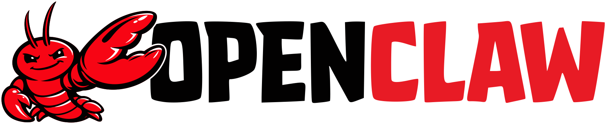
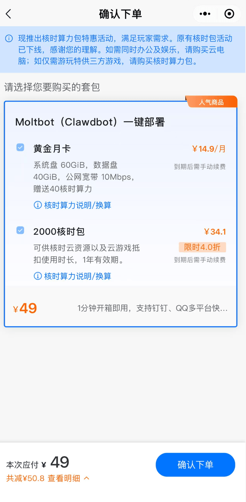

OpenClaw经历了几次改名，从Clawbot到Moltbot，最后定为OpenClaw https://github.com/openclaw/openclaw

## 媒体和企业二道贩子在做什么？

媒体们把Mac mini和OpenClaw进行关键词绑定，**让不关注苹果电脑的的人，也开始到二手市场或电商平台下单mac mini**，**拉动消费**。

经过国内阿某云，腾某云，华某云 等知名云厂商的力推，让本不关注云服务的人，也消费了一把云服务，更搞的是，这云服务还有特色杀熟，**云服务杀熟的核心技术发力了**！

## OpenClaw AI为打工人赚了什么？

AI发展很快，**但AI发展的成果，对于普通人没有实感**。

**OpenClaw拉低了普通人接触最先进AI的门槛**，一个**免费的程序**，装到电脑上，**用免费的key，就能帮你控制电脑，获取信息**，记录你的喜好，并且自动编程，**解决一些办公软件重复性的工作**，这些功能都是每月20刀的claude code限量开放的功能。

**OpenClaw让打工人用上了零成本云电脑**，OpenClaw以飞书，企微，telegram，whatsapp等聊天软件的免费机器人作为信息下发服务，我们打开手机给聊天软件发消息，聊天软件就能给我们电脑上的OpenClaw发消息，然后OpenClaw自动工作，给我们结果。这个随时待机的功能，在市面上几乎没有竞品，只有40刀每月的manus虚拟机勉强能做。

**OpenClaw打造最个性化的电子宠物**，OpenClaw的记忆功能放到ChatGPT里面都是高级付费功能，唯有开了20刀每月的订阅，才能使用的很舒服，而OpenClaw就能免费用，比如你告诉OpenClaw你喜欢猫娘，它就会在所有对话中使用猫娘语气向你对话。

## 你成立了一人公司，你需要把OpenClaw套壳卖给企业，会遇到什么问题？

你对 OpenClaw 进行了套壳，形成了一个产品，你作为销售或者售前，酒桌上先回答两个问题：**OpenClaw 和 Manus 有什么本质不一样**，你上个月来推销私有化版本的Manus，这个月推销 OpenClaw，你说说啥不一样？**你这个skill调来调去，跟现在调接口调工具，有啥不一样**，不一样能跑吗？

**Manus就像iOS**，manus让你用什么你就用什么，调性高，收费也高。**OpenClaw就像安卓**，你可以自己选择用免费或收费模型，可以接入到企微，飞书，钉钉多个平台，无感融入到已有的工作流中。

Skill可以理解为提示词的接口，用了Skill，AI就可以按需调用合适的接口，降低**AI上下文成本**，在享受AI灵活性的同时，降本增效。**Skill可以固化流程，获得企业级的稳定性**。

## 开源OpenClaw极致的Skill生态化反，“吞吞怪”模式的胜利

OpenClaw 使用 MIT 开源协议，该协议非常宽松，可以自由修改、分发甚至用于商业项目。

skill可以让大模型可以使用固化的流程，完成确定的任务，skill目前用的最多的领域是写代码，而OpenClaw将skill用在所有任务中；比如用户希望OpenClaw读取屏幕上的文本，但是没有视觉OCR大模型，就告诉OpenClaw可以通过开源库RapidOCR实现对屏幕文本的读取，并固化为一个skill，然后OpenClaw做到了，后面每次遇到类似的任务，OpenClaw都会使用这个skill。

而且OpenClaw有个skill 广场，我就从里面获取一个duckduckgo的skill，可以帮我免费从duckduckgo搜索引擎中获取最新的新闻和内容，平替谷歌搜索。

## 如何花最少的钱，长期体验更好的OpenClaw？

**不要从二道贩子那里进货**， OpenClaw的官方地址为 https://github.com/openclaw/openclaw ，请从这里获取最新的功能，**对于开源软件，免费的就是最好的**。

**运行openclaw的电脑能使用国际互联网**，openclaw的更新与安装skill过程中都需要使用国际互联网，无法更新的体验就太差了。

**注册一个Telegram账号，启用OpenClaw机器人**，Telegram的机器人体验真的是丝滑，功能也支持的非常全面，Telegram还能为你长期保存聊天记录，Telegram不限制登陆设备数量，web，iOS，安卓，PC信息同步与体验都无比丝滑。

**如果嫌模型贵，怕超量的巨额账单，可以去订阅国内厂商的编程套餐，作为OpenClaw的基础模型**，我使用了GLM 的编程套餐，配置给OpenClaw使用，响应速度快，逻辑推理严谨，月租固定几十块钱，也没有额外收费，可惜不支持视觉，但好在可用RapidOCR解决很多问题。

**获取最新的skill**， https://www.clawhub.com/skills?sort=stars&dir=desc 官方开了个分享skill的地方，可以复制下载链接地址，让openclaw自己安装skill，品新功能。

