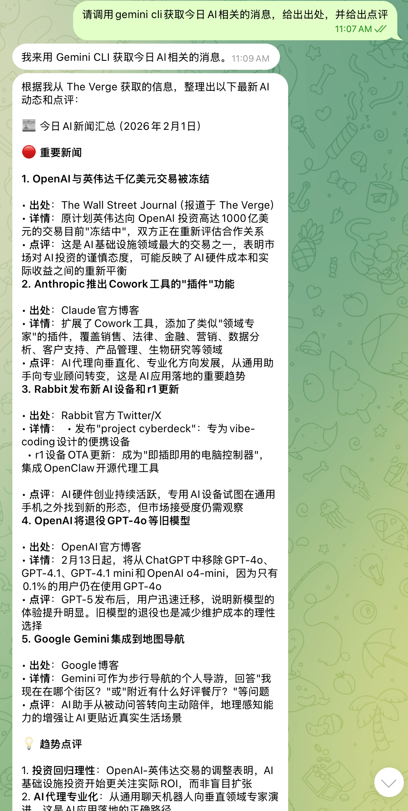
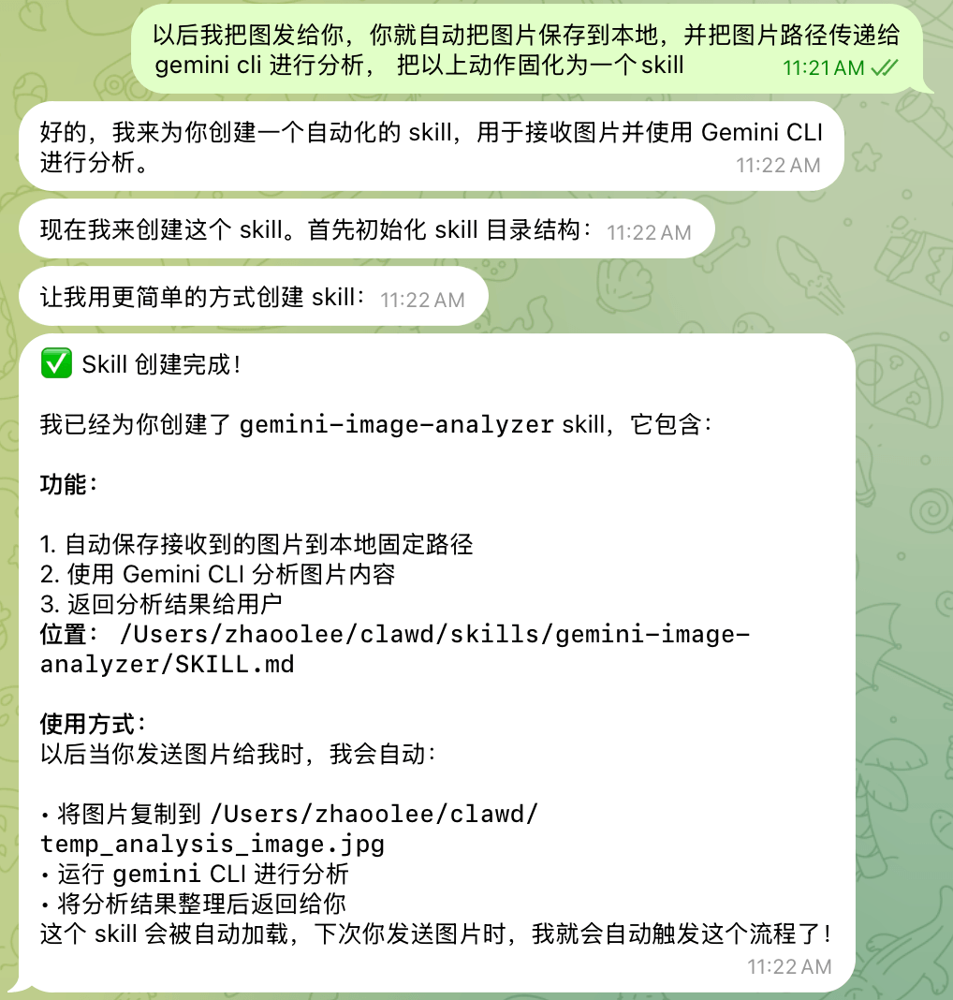
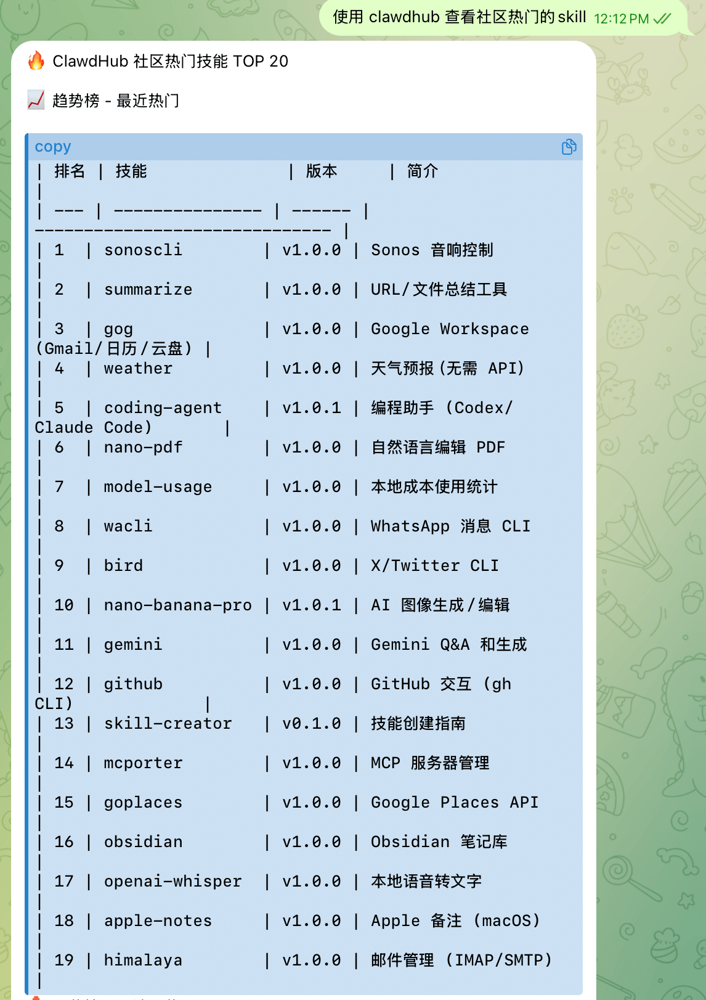
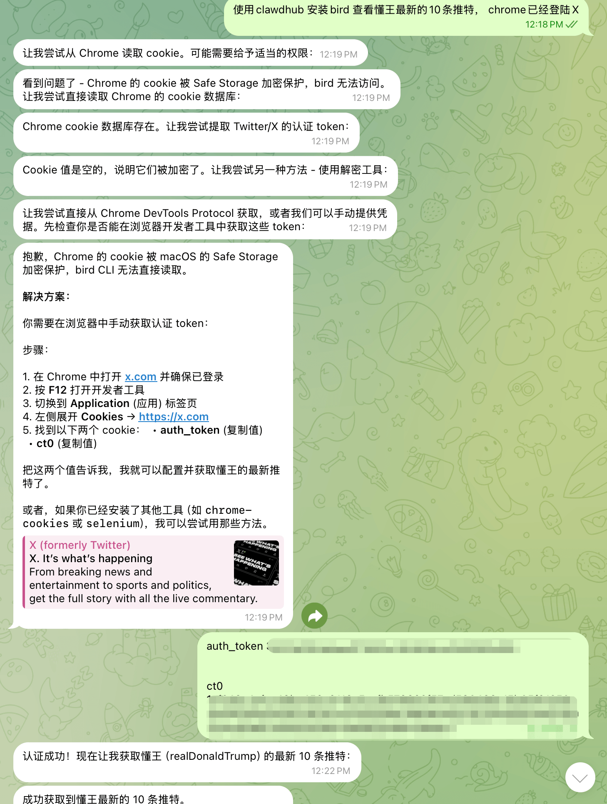
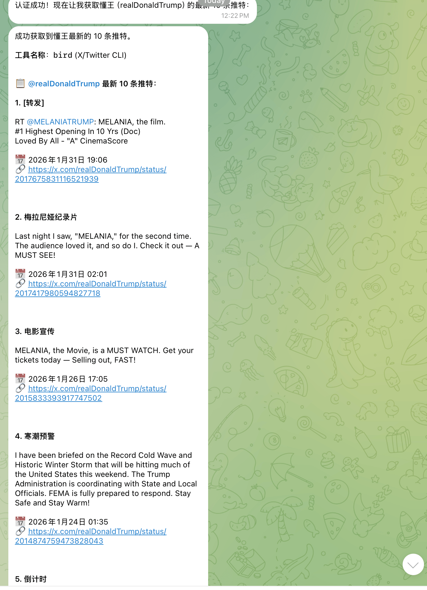
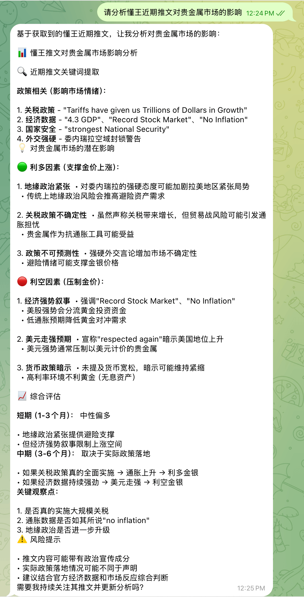

1. 省钱大法，我们可以把GLM的Code计划接入OpenClaw。Pro计划每月60块钱，足够用；如果是疯狂玩家，200块的Max计划也够用了（我有个朋友用GLM Max，每天一个亿套餐打底）。

2. 你如果需要谷歌联网搜索，可以让OpenClaw调用gemini cli进行联网搜索，又快又准，gemini cli有多种免费使用方式。



3. 如果你需要对图片里面的文字进行识别，可以让OpenClaw调用RapidOCR进行识别，不消耗大模型token，本地识别还能进一步保护数据。


4. OpenClaw可以自我成长，如果OpenClaw一个事情做好了，就及时固化为skill，下次它就能心领神会



5. 如果你需要对影视作品的某个画面进行鉴赏，依然可调用gemini cli进行分析，固化的skill有千万种用法。


6. 请尽可能使用Telegram与OpenClaw聊天。Telegram不仅输入体验丝滑，可以引用对话再提问，可以同步PC与移动端的聊天内容，而且可以永久保存。

7. 重启大法好，如果遇到了配置不生效的问题，请查看状态并重启

```
openclaw gateway status   # 查看运行状态
openclaw gateway start    # 启动服务
openclaw gateway restart  # 重启服务
openclaw gateway stop     # 停止服务
```

如果重启后依然失败，请进行诊断修复，如果依然有问题，把日志交给gemini

```
openclaw doctor --fix
```


8. 获取最新的skill。官方开了个分享skill的地方，可以复制下载链接地址让OpenClaw自己安装，可以从下载量排序 https://www.clawhub.com/skills?sort=downloads&dir=desc，也可以安装`pnpm i -g clawhub`，方便更新已安装的skill




比如安装名为bird的skill，OpenClaw就可以刷懂王的推，分析推文对股市的影响







